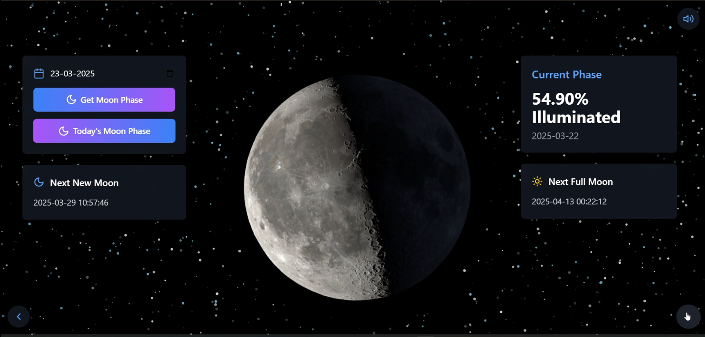

# 🌙 Moon Phase Visualizer

A simple web application that allows users to input a date and view the moon phase information for that day — including illumination percentage, moon phase image, next new moon, and next full moon.

Built with **React (Frontend)**, **Tailwind CSS**, and **FastAPI (Backend)**.

---

## 🚀 Features

- Enter a date to visualize the moon's phase.
- Displays:
  - Illumination percentage
  - Corresponding moon phase image
  - Date and time of the next new moon
  - Date and time of the next full moon
- Smooth starry background animation ✨
- Fast and lightweight backend using FastAPI.
- CORS enabled for easy frontend-backend communication.

---

## 🛠 Tech Stack

- **Frontend:** React, Tailwind CSS, Axios
- **Backend:** FastAPI, Ephem (astronomy calculations)
- **Other:** Static file serving (for moon phase images)

---

## 📁 Project Structure

```
root/
├── assets/
│   ├── app.css          # Tailwind and custom styles
│   ├── app.jsx          # Main React app
│   ├── index.css        # Global styles
│   ├── main.jsx         # React app entry point
├── moon_images/         # Static images for moon phases
├── main.py              # FastAPI backend server
├── README.md            # This documentation
└── package.json         # React project dependencies
```

---

## ⚙️ Setup Instructions

### 1. Clone the repository

```bash
git clone https://github.com/your-username/moon-phase-visualizer.git
cd moon-phase-visualizer
```

### 2. Frontend Setup (React)

- Install Node.js (if not installed).
- Install dependencies:

```bash
npm install
```

- Run the React development server:

```bash
npm run dev
```

Frontend will be available at `http://localhost:5173/` (or as configured).

---

### 3. Backend Setup (FastAPI)

- Create a virtual environment (optional but recommended):

```bash
python -m venv env
source env/bin/activate  # On Windows: .\env\Scripts\activate
```

- Install Python dependencies:

```bash
pip install fastapi uvicorn ephem pydantic
```

- Run the FastAPI server:

```bash
uvicorn main:app --reload
```

Backend will be available at `http://127.0.0.1:8000/`.
```

(Feature needs to be added if required.)

---

## 📸 Screenshots

  


---

## 📜 License

This project is licensed under the [MIT License](LICENSE).

---

## 🤝 Contributing

Pull requests are welcome!  
Feel free to open issues or submit features you'd like to see!

---
